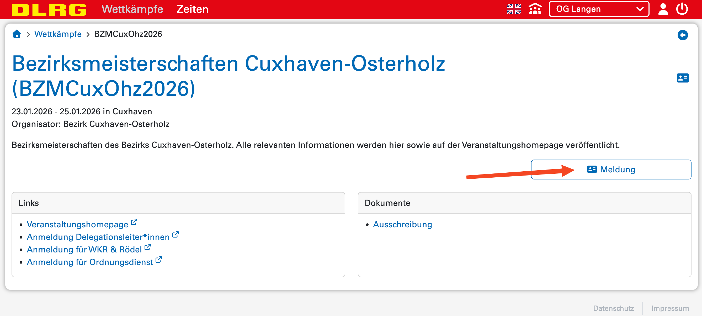
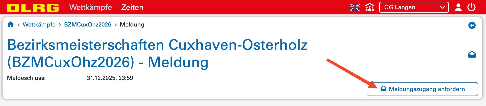
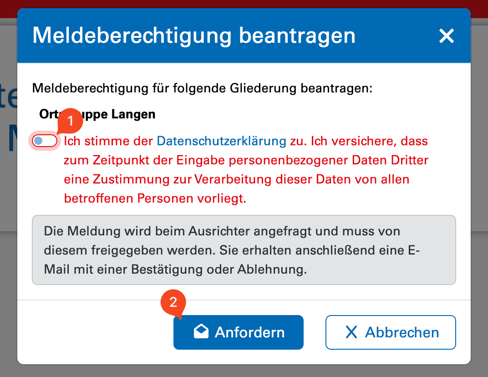
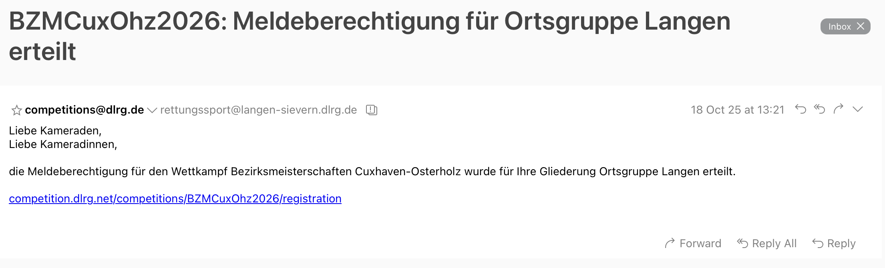

# Meldezugang anfordern

Hier ist beschrieben, wie der Meldezugang für die Gliederung im
 Meldeportal angefordert werden kann.

Zunächst ist im Meldeportal der Bereich Meldung auszuwählen.

Dort kann nun der Meldezugang angefordert werden.

Hier müssen nun die Datenschutzbestimmungen des Bundesverbandes
    akzeptiert werden und der Meldezugang kann endgültig angefordert
    werden. 

Nun muss der Meldezugang für eure Gliederung durch den Bezirk
    freigegeben werden. Wir bemühen uns, diesen schnellstmöglich
    freizuschalten. Dies kann jedoch einige Tage dauern, daher möchte
    wir euch bitten, euren Zugang rechtzeitig anzufragen.

Sobald die Freischaltung erfolgt ist, erhält die Adresse
    **rettungssport@*gliederung*.dlrg.de** eine E-Mail mit der
    entsprechenden Information.

