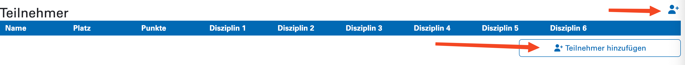
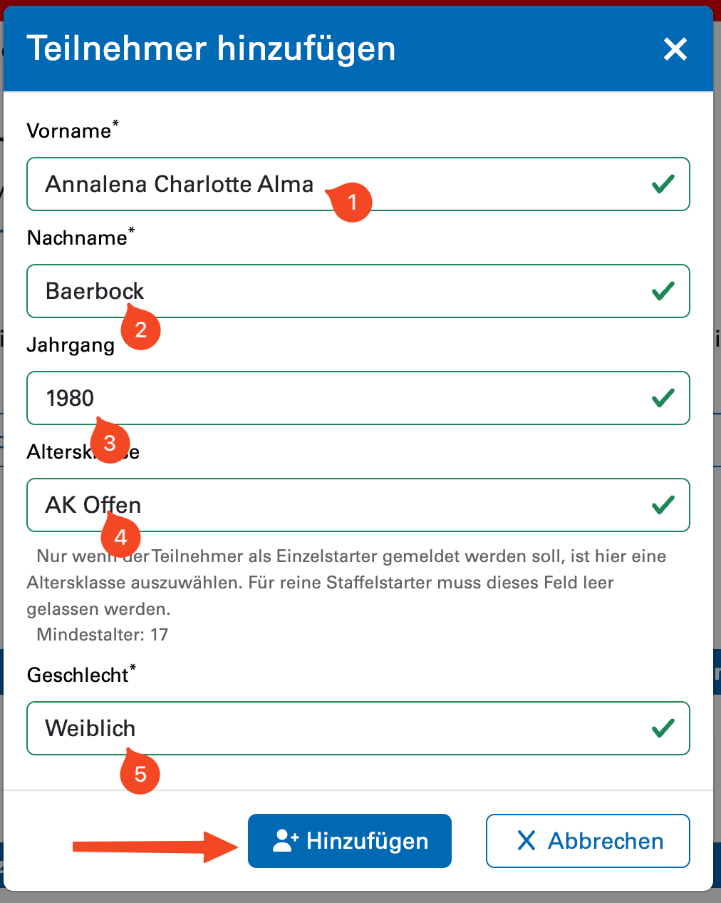
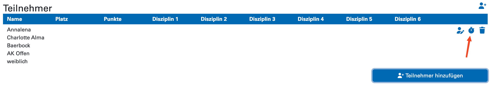
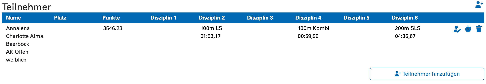
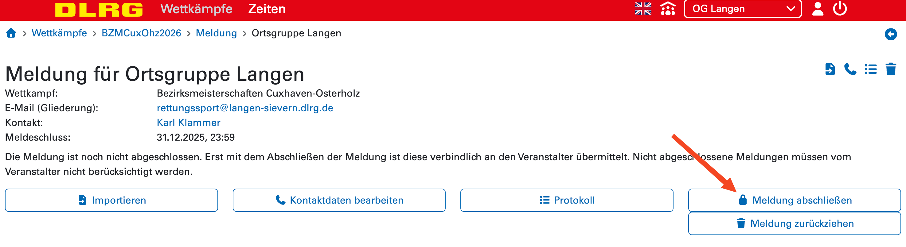
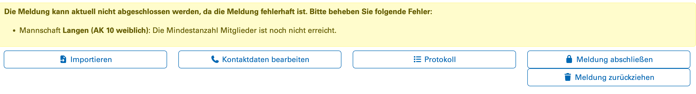
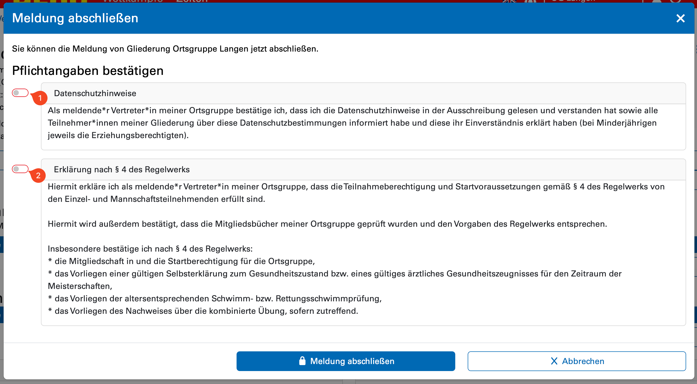
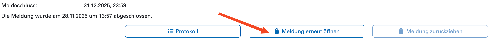

# Meldevorgang

Hier wird nun beschrieben, wie für die Meldung vorzugehen ist.

## Kontaktdaten

In der Meldung im Meldeportal können nun zunächst mit einem Klick
    auf **Kontaktdaten bearbeiten** die Kontaktdaten der meldenden
    Person bearbeitet werden. 
    

Dort können Name (1), E-Mail-Adresse (2) sowie Telefonnummer (3)
    angegeben werden. An diese Adresse werden Informationen über
    veröffentlichte Daten gesendet. Dieses Formular **ist keine**
    Meldung des\*der Delegationsleiter\*in. Dies erfolgt, wie 
    [im allgemeinen Abschnitt](./index.md)
    beschrieben, im ISC. Per Klick auf
    Speichern
    können die Daten gespeichert werden.

## Mannschaften
Im Bereich **Mannschaften** kann per
    _Mannschaft hinzufügen_
    eine neue Mannschaft angelegt werden.

Hier kann zunächst nur der Mannschaftsname, die Altersklasse sowie
    das Geschlecht ausgewählt werden. Beachtet, dass wir uns
    vorbehalten, die Mannschaftsnamen auf ***Gliederung* 1**,
    ***Gliederung* 2**, usw. anzupassen, falls dies nicht der angegebene
    Name ist. 

## Einzelsportler*innen
Zur Meldung von Einzelsportler\*innen kann im Abschnitt **Teilnehmener** 
    per _Teilnehmer hinzufügen_ ein\*e neue\*r Teilnehmer\*in hinzugefügt
    werden.

Im folgenden Dialog werden Vorname (1), Name (2), Jahrgang (3) und 
    Geschlecht (5) ausgewählt. 

Hier können auch Personen hinzugefügt werden, die reine Mannschaftsmitglieder sind.
    In diesem Fall darf im Feld Altersklasse (4) keine Altersklasse
    ausgewählt werden. Falls hier eine ausgewählt wird, wird die 
    Person für den Einzelwettkampf gemeldet.

Nach dem Speichern kann mit dem Klick auf das Stoppuhr-Symbol
    ggf. die Disziplinauswahl durchgeführt werden und Meldepunkte
    eingetragen werden.

Im folgenden Dialog werden die Disziplinen ausgewählt und Meldepunkte angegeben.
    Die Meldezeiten werden dabei ohne Doppelpunkte und Kommata eingegeben, 
    die Zeichen werden automatisch eingefügt. Rechts neben der Eingabe kann diese
    kontrolliert werden. 

In der Tabelle lassen sich dann alle eingegebenen Daten noch einmal kontrollieren.

## Abschließen der Meldung
Zum Abschließen der Meldung kann der **Meldung abschließen**-Knopf gedrückt werden.

Das System weist nun auf eventuelle Probleme mit der Meldung hin, die vor dem 
    Abschließen korrigiert werden müssen.

Falls keine Probleme bestehen, öffnet sich ein Dialog, in dem die Pflichtangaben, 
    in unserem Fall die Datenschutzerklärung (1) sowie die Erklärung nach § 4 des 
    Regelwerks (2) bestätigt werden müssen.

Nach einem weiteren Klick auf **Meldung abschließen** ist die Meldung abgegeben
    und wird für den Wettkampf berücksichtigt. 

Bis zum Meldeschluss kann die Meldung jederzeit mit Klick auf **Meldung erneut 
    öffnen** zum Bearbeiten wieder geöffnet werden.

Danach sollte sie wieder geschlossen werden.
