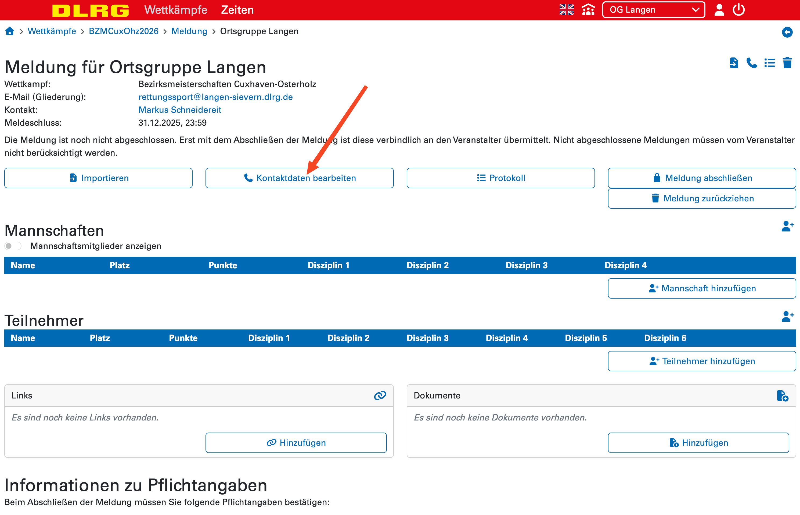
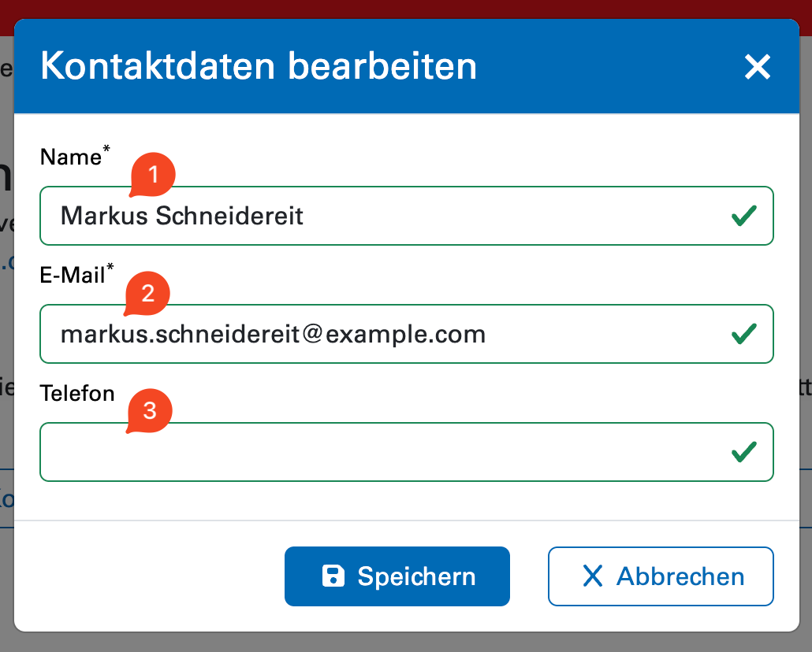
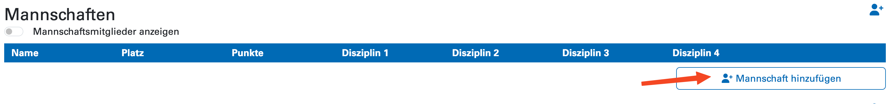
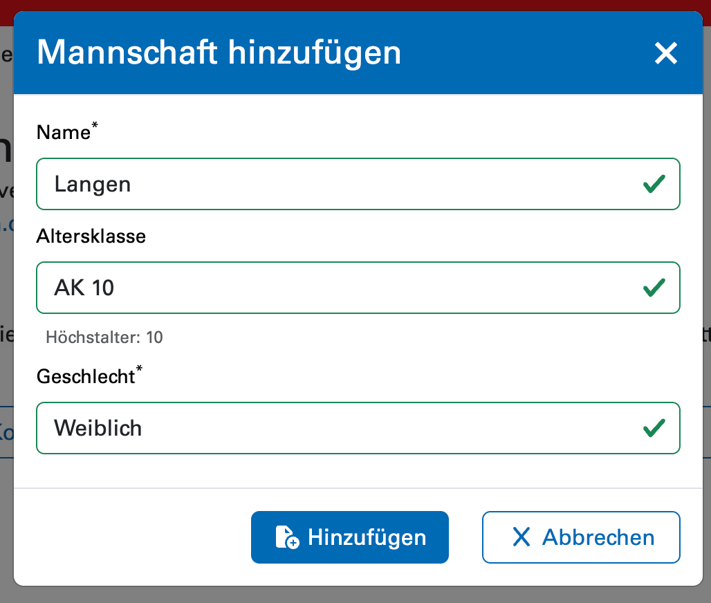

# Meldung für die Bezirksmeisterschaften 2026

Hier wird nun beschrieben, wie für die Meldung für die
Bezirksmeisterschaften vorzugehen ist.

## Kontaktdaten

In der Meldung im Meldeportal können nun zunächst mit einem Klick
    auf **Kontaktdaten bearbeiten** die Kontaktdaten der meldenden
    Person bearbeitet werden. 
    

Dort können Name (1), E-Mail-Adresse (2) sowie Telefonnummer (3)
    angegeben werden. An diese Adresse werden Informationen über
    veröffentlichte Daten gesendet. Dieses Formular **ist keine**
    Meldung des\*der Delegationsleiter\*in. Dies erfolgt, wie 
    [im allgemeinen Abschnitt](./index.md)
    beschrieben, im ISC. Per Klick auf
    Speichern
    können die Daten gespeichert werden.

## Mannschaften
Im Bereich **Mannschaften** kann per
    _Mannschaft hinzufügen_
    eine neue Mannschaft angelegt werden.

Hier kann zunächst nur der Mannschaftsname, die Altersklasse sowie
    das Geschlecht ausgewählt werden. Beachtet, dass wir uns
    vorbehalten, die Mannschaftsnamen auf ***Gliederung* 1**,
    ***Gliederung* 2**, usw. anzupassen, falls dies nicht der angegebene
    Name ist. 

## Einzelsportler*innen

## Abschließen der Meldung
