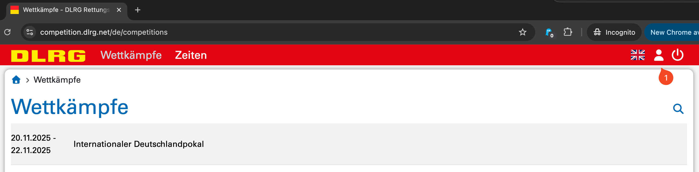
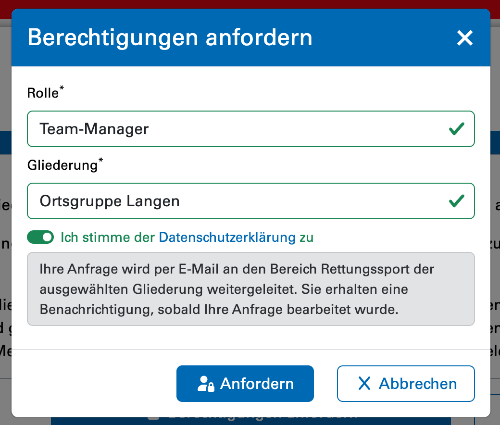
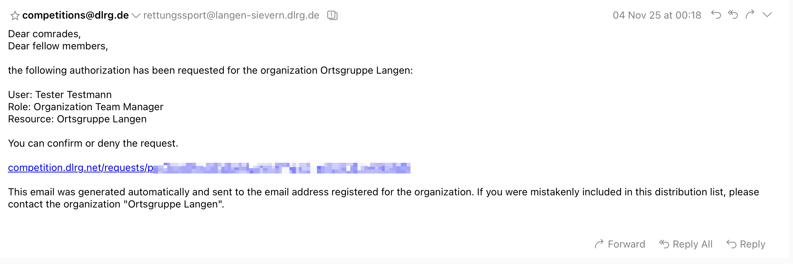

# Registrierung im Meldeportal

Zur Registrierung kann das 
 [Meldeportal](https://competition.dlrg.net/de/competitions)
 geöffnet werden. 
Mit einem Klick auf _Login_ ist ein Login mit einem DLRG-Account
 möglich.

Anschließend kann mit einem Klick auf das Personen-Icon das
 eigene Profil geöffnet werden.

Unter _Berechtigungen_ kann mittels _Berechtigungen anfordern_
 eine Berechtigung für eine Gliederung angefordert werden.

Nach einem Klick auf _Anfordern_ erhält die Adresse
 **rettungssport@*gliederung*.dlrg.de** eine entsprechende 
 Nachricht.

Mit einem Klick auf den Link auf die Nachricht
 kann die Anfrage angenommen oder abgelehnt werden. 
Nach der Bestätigung erhält der entsprechende Account
 eine E-Mail und kann nun Meldungen im Namen der 
 Gliederung vornehmen.
Die Liste der Berechtigten sollte regelmäßig überprüft 
 werden:

- [Berechtigungsübersicht](https://competition.dlrg.net/de/organizations/current/permissions)
